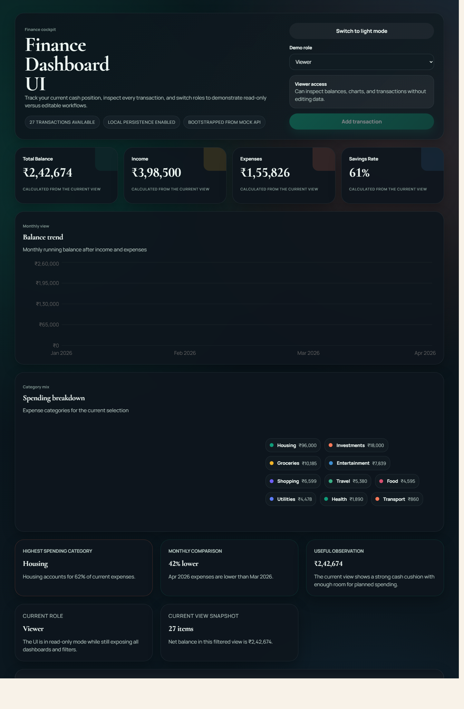

# Finance Dashboard UI

A fresh frontend-only finance dashboard built for the assignment brief using React, TypeScript, Vite, and Recharts. The app focuses on clarity, role-based interaction, and readable finance storytelling without any backend dependency.

## Live Demo

- Vercel deployment: [finance-dashboard-ui-zorvyn-theta.vercel.app](https://finance-dashboard-ui-zorvyn-theta.vercel.app)

## Screenshots

### Desktop



## Description

This project covers the required areas from the brief:

- Dashboard overview with summary cards for Total Balance, Income, Expenses, and Savings Rate
- One time-based visualization for monthly running balance
- One categorical visualization for spending breakdown by category
- Transaction list with search, category filter, type filter, and sorting
- Frontend-only role simulation with `Viewer` and `Admin`
- Insights section with highest spending category, month comparison, and a plain-language observation
- State management with React Context + `useReducer`
- Responsive layout and explicit empty-state handling

## Tech Stack

- React 19
- TypeScript
- Vite
- Recharts
- Custom CSS

## Features

### Dashboard Overview

- Gradient hero section with quick assignment context
- Summary cards derived from the currently filtered dataset
- Monthly balance trend chart
- Expense category donut chart with breakdown legend

### Transactions Workspace

- Transaction table with date, title, category, type, amount, and edit action
- Search by merchant/title, note, or category
- Category and type filters
- Date range filtering
- Sorting by newest, oldest, highest amount, and lowest amount
- Optional grouping by category, month, or type

### Role-Based UI

- `Viewer` can inspect data and use all filters
- `Admin` can add transactions
- `Admin` can edit transactions
- `Admin` can reset the seeded demo data
- `Admin` can clear all transactions

### Insights

- Highest spending category
- Month-over-month comparison
- Cash-flow observation based on savings rate and net balance

### UX Details

- Warm neutral visual theme with emerald, coral, sand, and sky accents
- Dark mode toggle with saved preference
- Subtle card motion and hover lift
- Local persistence with `localStorage`
- Mock API-style loading bootstrap for demo transactions
- Export controls for CSV and JSON
- Empty state for no transactions in the dataset
- Empty state for no matches after filtering
- Empty state for chart sections with no data

## State Management Approach

The app uses a shared React Context with `useReducer` to keep state transitions explicit and predictable.

Managed state includes:

- transactions
- active filters
- selected demo role
- selected theme mode
- mock loading state and data source label

Derived values such as totals, chart series, and insights are generated through analytics helper functions instead of being stored separately.

## Local Setup

```bash
npm install
npm run dev
```

The Vite development server will start on the default local port shown in the terminal.

## Available Scripts

- `npm run dev` starts the local dev server
- `npm run build` creates a production build
- `npm run preview` previews the build locally
- `npm run lint` runs ESLint

## Verification

The project was verified locally with:

- `npm run lint`
- `npm run build`

## Assumptions

- The dashboard is intentionally frontend-only and uses a mock API simulation plus static demo data
- INR formatting and India-based merchants/categories are used throughout
- Role switching is a visual simulation only, not authentication or real RBAC
- Data persistence is handled through `localStorage` to make the demo feel more complete

## Project Structure

```text
src/
  components/
  context/
  data/
  types/
  utils/
```

